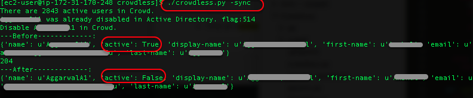

# CrowdLess

## Description
CrowdLess is a tool that syncs the disabled account from Active Directory to Crowd (make Crowd less crowded). Since Crowd 2.7, the Active Directory Connector is able to sync the disabled flag from AD to Crowd. The tool is useful for older version Crowd and other connectors, e.g Delegated Authentication Directory.

## Features
- [x] Show all active users in Crowd
- [x] Check user status in Active Directory
- [x] Check user status in Crowd
- [x] Compare user status between Active Directory and Crowd
- [x] Disable user in Crowd
- [x] Enable user in Crowd
- [x] Synchronize disabled user from Active Directory to Crowd
- [x] Report mode for synchronization

## Usage
Custom your parameters in params.py file, use params-samplep.py as a reference.

|Optional arguments       | Description|                   
|------------------       | ---------------------|
|-h, --help               | show this help message and exit|
|-a, --active             | show all active users in Crowd|
|-c username              | compare a user between AD and Crowd
|-d username              | disable a use in Crowd
|-e username              | enable a use in Crowd
|-r, --report             | report mode of synchronize, work with -sync
|--search-ad username     | search a user status in AD
|--search-crowd username  | search a user in Crowd
| -sync, --synchronize    | synchronize disabled user from AD to Crowd

## Example

## Reference
https://docs.atlassian.com/atlassian-crowd/3.1.1/REST/#usermanagement/1/search-search
https://developer.atlassian.com/display/CROWDDEV/Crowd+Query+Language#CrowdQueryLanguage-GroupFields
https://developer.atlassian.com/display/CROWDDEV/JSON+Requests+and+Responses#JSONRequestsandResponses-Authenticatingwithapassword
https://github.com/m4ce/crowd-api-python
https://community.atlassian.com/t5/Crowd-questions/crowd-with-AD-connector-how-detect-disabled-users/qaq-p/165309
https://confluence.atlassian.com/jirakb/what-is-the-difference-between-connector-and-delegated-ldap-user-directories-686861143.html
https://confluence.atlassian.com/crowd/configuring-a-delegated-authentication-directory-128287004.html